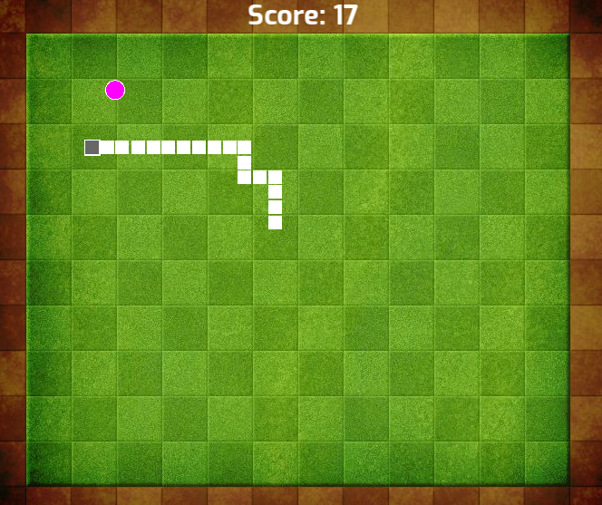

# Snayke - C++

This is a simple implementation of the classic Snake game using the SFML library in C++. In this game, you control a snake using arrow keys, eat food to increase your score, and avoid boundaries and self-collisions to prevent game over.



## Features

- **Eat Food**: The snake grows and your score increases when the snake eats food.
- **Game Over**: The game ends if the snake goes out of bounds or crashes into itself.
- **Controls**: Use the arrow keys to navigate the snake.

## Includes

```cpp
#include <SFML/Audio.hpp>
#include <SFML/Graphics.hpp>
#include <iostream>
#include <random>
#include <string>
#include <thread>
#include <vector>
```

## Build(Windows)

- Checkout build folder
